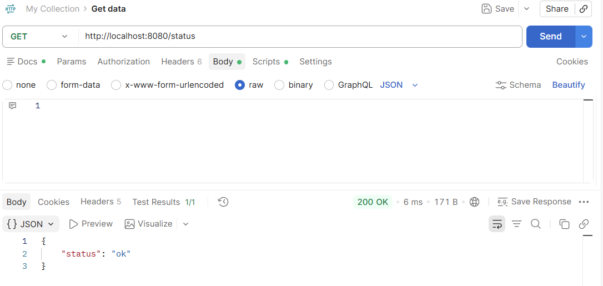

Nome: Davi Salvador Schubert
Curso: Informática para Internet
UC: Desenvolver Serviços Web
 
Esse projeto individual se baseia em uma API gerenciadora de missões espaciais, capaz de pesquisar, cadastrar, atualizar e deletar missões.
 
Foram utilizadas as tecnologias:
- PHP
- Slim Framework
- Composer
- JSON
 
Para clonar esse projeto, você deve entrar no app Windows Powershell e digitar:
- git clone 
 
Para instalar as dependências deste projeto, você deve entrar no terminal VSCode ou Windows Powershell e digitar:
- composer require slim/slim
e
- composer require slim/psr7
 
Para executar este projeto, você deve entrar no terminal VSCode ou Windows Powershell e digitar:
- php -S localhost:8080 -t public
 
Testes do projeto:

- URL: localhost:8080/status
- Objetivo: Verificar se o status está ok.
- Ex. de Requisição: GET /status
- Ex. de Resposta: { "status" : "ok" }
 
![GET /missoes]!(image-5.png)
- URL: localhost:8080/missoes
- Objetivo: Pesquisar todas as missões cadastradas.
- Ex. de Requisição: GET /missoes
- Ex. de Resposta:
[
    {
        "id": 1,
        "nome": "Apollo 11",
        "ano": 1969,
        "agencia": "NASA",
        "status": "Concluída"
    },
    {
        "id": 2,
        "nome": "Mars Pathfinder",
        "ano": 1997,
        "agencia": "JPL",
        "status": "Em andamento"
    },
    {
        "id": 3,
        "nome": "Europa Clipper",
        "ano": 2024,
        "agencia": "NASA",
        "status": "Planejada"
    },
    {
        "id": 4,
        "nome": "James Webb Space Telescope",
        "ano": 2021,
        "agencia": "NASA/ESA/CSA",
        "status": "Em andamento"
    },
    {
        "id": 5,
        "nome": "Artemis I",
        "ano": 2022,
        "agencia": "NASA",
        "status": "Planejada"
    },
    {
        "id": 6,
        "nome": "Mars 2020 (Perseverance Rover)",
        "ano": 2020,
        "agencia": "NASA",
        "status": "Em andamento"
    },
    {
        "id": 7,
        "nome": "TESS (Transiting Exoplanet Survey Satellite)",
        "ano": 2018,
        "agencia": "NASA",
        "status": "Em andamento"
    },
    {
        "id": 8,
        "nome": "Rosetta",
        "ano": 2004,
        "agencia": "ESA",
        "status": "Concluída"
    },
    {
        "id": 9,
        "nome": "Hubble Space Telescope",
        "ano": 1990,
        "agencia": "NASA/ESA",
        "status": "Em andamento"
    },
    {
        "id": 10,
        "nome": "Voyager 1",
        "ano": 1977,
        "agencia": "NASA",
        "status": "Em andamento"
    }
]
 
![GET /missoes/2]!(image-6.png)
- URL: localhost:8080/missoes/2
- Objetivo: Pesquisar a missão com id 2.
- Ex. de Requisição: GET /missoes/2
- Ex. de Resposta:
{
    "id": 2,
    "nome": "Mars Pathfinder",
    "ano": 1997,
    "agencia": "JPL",
    "status": "Em andamento"
}
 
![POST /missoes]!(image-7.png)
- URL: localhost:8080/missoes
- Objetivo: Cadastrar uma nova missão.
- Ex. de Requisição: POST /missoes
{
    "id": 11,
    "nome": "Mars Pathfinder",
    "ano": 1997,
    "agencia": "JPL",
    "status": "Em andamento"
}
 
- Ex. de Resposta:
{
    "id": 11,
    "nome": "Mars Pathfinder",
    "ano": 1997,
    "agencia": "JPL",
    "status": "Em andamento"
}
 
![PUT /missoes/8]!(image-8.png)
- URL: localhost:8080/missoes/8
- Objetivo: Atualizar a missão cadastrada com id 8.
- Ex. de Requisição: PUT /missoes/8
{
    "id": 8,
    "nome": "Mario",
    "ano": 2004,
    "agencia": "ESA",
    "status": "Concluída"
}
 
- Ex. de Resposta:
{
    "id": 8,
    "nome": "Mario",
    "ano": 2004,
    "agencia": "ESA",
    "status": "Concluída"
}
 
![DELETE /missoes/8]!(image-9.png)
- URL: localhost:8080/missoes/8
- Objetivo: Deletar a missão cadastrada com id 8.
- Ex. de Requisição: DELETE /missoes/8
- Ex. de Resposta: 1
 